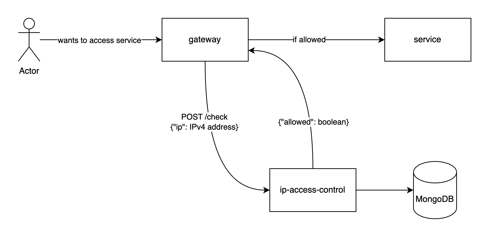

# ip-access-control

## What is it about
Service is created for checking if specific IPv4 address has access to the target resource. This diagram shows the idea.

But this is just the tip of the iceberg. To achieve it, you have to complete these use cases:
* [User creation](docs/user-creation.md)
* [User activation](docs/user-activation.md)
* [Getting access](docs/getting-access.md)

